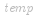
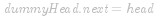
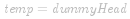

#### 方法一：递归

链表的定义具有递归的性质，因此链表题目常可以用递归的方法求解。这道题要求删除链表中所有节点值等于特定值的节点，可以用递归实现。

对于给定的链表，首先对除了头节点   以外的节点进行删除操作，然后判断   的节点值是否等于给定的  。如果   的节点值等于  ，则   需要被删除，因此删除操作后的头节点为  ；如果   的节点值不等于  ，则   保留，因此删除操作后的头节点还是  。上述过程是一个递归的过程。

递归的终止条件是   为空，此时直接返回  。当   不为空时，递归地进行删除操作，然后判断   的节点值是否等于   并决定是否要删除  。

```Java [sol1-Java]
class Solution {
    public ListNode removeElements(ListNode head, int val) {
        if (head == null) {
            return head;
        }
        head.next = removeElements(head.next, val);
        return head.val == val ? head.next : head;
    }
}
```

```C# [sol1-C#]
public class Solution {
    public ListNode RemoveElements(ListNode head, int val) {
        if (head == null) {
            return head;
        }
        head.next = RemoveElements(head.next, val);
        return head.val == val ? head.next : head;
    }
}
```

```JavaScript [sol1-JavaScript]
var removeElements = function(head, val) {
    if (head === null) {
            return head;
        }
        head.next = removeElements(head.next, val);
        return head.val === val ? head.next : head;
};
```

```go [sol1-Golang]
func removeElements(head *ListNode, val int) *ListNode {
    if head == nil {
        return head
    }
    head.Next = removeElements(head.Next, val)
    if head.Val == val {
        return head.Next
    }
    return head
}
```

```C++ [sol1-C++]
class Solution {
public:
    ListNode* removeElements(ListNode* head, int val) {
        if (head == nullptr) {
            return head;
        }
        head->next = removeElements(head->next, val);
        return head->val == val ? head->next : head;
    }
};
```

```C [sol1-C]
struct ListNode* removeElements(struct ListNode* head, int val) {
    if (head == NULL) {
        return head;
    }
    head->next = removeElements(head->next, val);
    return head->val == val ? head->next : head;
}
```

**复杂度分析**

- 时间复杂度：*O(n)*，其中 *n* 是链表的长度。递归过程中需要遍历链表一次。

- 空间复杂度：*O(n)*，其中 *n* 是链表的长度。空间复杂度主要取决于递归调用栈，最多不会超过 *n* 层。

#### 方法二：迭代

也可以用迭代的方法删除链表中所有节点值等于特定值的节点。

用   表示当前节点。如果   的下一个节点不为空且下一个节点的节点值等于给定的  ，则需要删除下一个节点。删除下一个节点可以通过以下做法实现：

 

如果   的下一个节点的节点值不等于给定的  ，则保留下一个节点，将   移动到下一个节点即可。

当   的下一个节点为空时，链表遍历结束，此时所有节点值等于   的节点都被删除。

具体实现方面，由于链表的头节点   有可能需要被删除，因此创建哑节点  ，令  ，初始化  ，然后遍历链表进行删除操作。最终返回   即为删除操作后的头节点。

```Java [sol2-Java]
class Solution {
    public ListNode removeElements(ListNode head, int val) {
        ListNode dummyHead = new ListNode(0);
        dummyHead.next = head;
        ListNode temp = dummyHead;
        while (temp.next != null) {
            if (temp.next.val == val) {
                temp.next = temp.next.next;
            } else {
                temp = temp.next;
            }
        }
        return dummyHead.next;
    }
}
```

```C# [sol2-C#]
public class Solution {
    public ListNode RemoveElements(ListNode head, int val) {
        ListNode dummyHead = new ListNode(0);
        dummyHead.next = head;
        ListNode temp = dummyHead;
        while (temp.next != null) {
            if (temp.next.val == val) {
                temp.next = temp.next.next;
            } else {
                temp = temp.next;
            }
        }
        return dummyHead.next;
    }
}
```

```JavaScript [sol2-JavaScript]
var removeElements = function(head, val) {
    const dummyHead = new ListNode(0);
    dummyHead.next = head;
    let temp = dummyHead;
    while (temp.next !== null) {
        if (temp.next.val == val) {
            temp.next = temp.next.next;
        } else {
            temp = temp.next;
        }
    }
    return dummyHead.next;
};
```

```go [sol2-Golang]
func removeElements(head *ListNode, val int) *ListNode {
    dummyHead := &ListNode{Next: head}
    for tmp := dummyHead; tmp.Next != nil; {
        if tmp.Next.Val == val {
            tmp.Next = tmp.Next.Next
        } else {
            tmp = tmp.Next
        }
    }
    return dummyHead.Next
}
```

```C++ [sol2-C++]
class Solution {
public:
    ListNode* removeElements(ListNode* head, int val) {
        struct ListNode* dummyHead = new ListNode(0, head);
        struct ListNode* temp = dummyHead;
        while (temp->next != NULL) {
            if (temp->next->val == val) {
                temp->next = temp->next->next;
            } else {
                temp = temp->next;
            }
        }
        return dummyHead->next;
    }
};
```

```C [sol2-C]
struct ListNode* removeElements(struct ListNode* head, int val) {
    struct ListNode* dummyHead = malloc(sizeof(struct ListNode));
    dummyHead->next = head;
    struct ListNode* temp = dummyHead;
    while (temp->next != NULL) {
        if (temp->next->val == val) {
            temp->next = temp->next->next;
        } else {
            temp = temp->next;
        }
    }
    return dummyHead->next;
}
```

**复杂度分析**

- 时间复杂度：*O(n)*，其中 *n* 是链表的长度。需要遍历链表一次。

- 空间复杂度：*O(1)*。